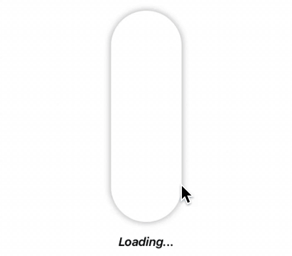
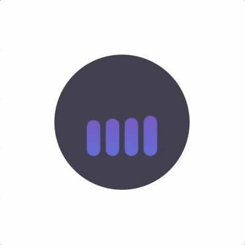
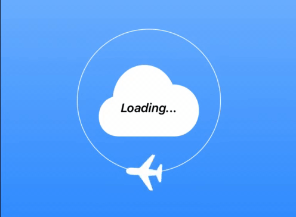
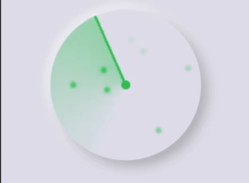
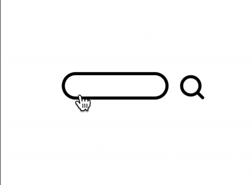
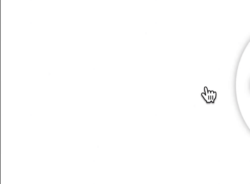
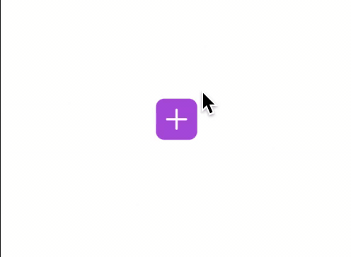
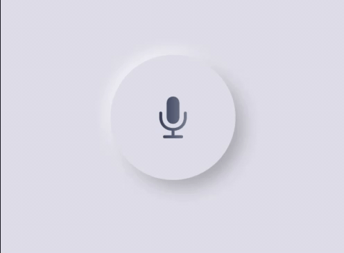

# SwiftUI Animations

## Environment

- XCode 12.0.1
- Swift 5
- iOS 14
- Iphone 11 as emulator

## Animations

* You can find all source code under /Animations/Animations

### <a href="/Animations/Animations/TouchRender.swift">Touch Render (Uses SprikeKit) </a>

### <a href="/Animations/Animations/CircleLoading.swift">Circle Loading </a>

### <a href="/Animations/Animations/DarkModeToggle.swift"> Darkmode Toggle </a>

### <a href="/Animations/Animations/DownloadButton.swift"> Download Button </a>

### <a href="/Animations/Animations/FluidLoading.swift"> Fluid Loading </a>

### <a href="/Animations/Animations/MusicAnimation.swift"> Music Animation </a>

### <a href="/Animations/Animations/PipeLoading.swift"> Pipe Loading </a>

### <a href="/Animations/Animations/PlaneLoading.swift"> Plane Loading </a>

### <a href="/Animations/Animations/Radar.swift"> Radar </a>

### <a href="/Animations/Animations/Search.swift"> Search </a>

### <a href="/Animations/Animations/SideRotateMenu.swift"> Side Rotation Menu </a>

### <a href="/Animations/Animations/SplitMenu.swift"> Split Menu </a>

### <a href="/Animations/Animations/TabBar.swift"> Tab Bar </a>

### <a href="/Animations/Animations/VoiceRecord.swift"> Voice Record </a>

### <a href="/Animations/Animations/Wifi Search.swift"> Wifi Search </a>

